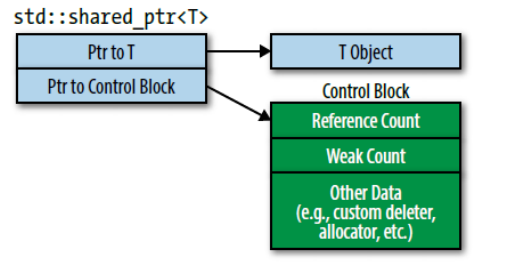
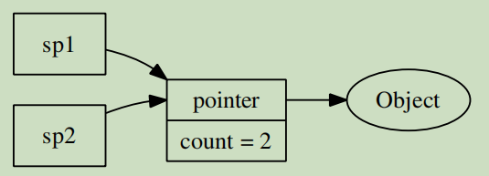

---

---

## 国庆前的面试总结

### 智能指针

#### unique_ptr

拷贝操作不允许: 因为能拷贝的话两个unique_ptr都认为自己拥有资源,销毁就会重复销毁.

销毁通过delete进行,但可以自定义unique_ptr**指向对象**的析构函数.

原始指针复制给unique_ptr通不过编译,因为没有原始指针到智能指针的隐式转换,通过reset来传递new指针.(通过forward)

删除器是函数指针,但lambda不占空间,无状态对象(没有捕获的lambda)对大小没影响,所以尽量用lambda定义删除器

unique_ptr可以用于数组(unique_ptr<T[]>), 但不应该被使用,vector,array,string比较好. shared_ptr没有[]运算符重载.

unique_ptr可以轻松转换成shared_ptr.反之不行.

---

#### shared_ptr

通过shared_ptr访问的**对象**其声明周期由指向他们的指针们共享所有权,没有特定的shared_ptr拥有该对象.通过引用计数确保它是否是最后一个指向资源的指针.

移动构造函数会使引用计数不变. 拷贝构造可能递增/递减. sp1=sp2: sp1指向sp2对象,sp1的count--,sp2的count++. shared_ptr发现引用计数为0,没有其他shared_ptr指向该资源,就会销毁资源(但不一定删除proxy).




shared_ptr大小是原始指针两倍: 指向资源的指针和指向控制块的指针.

引用计数必须动态分配

引用计数增减是原子性的.

shared_ptr使用delete作为资源销毁器,但不是智能指针的一部分(unique_ptr是)

```c++
auto Del = [](Widget * pw){makeLogEntry(pw); delete pw;};
unique_ptr<Widget, decltype(Del)> upw(new Widget, Del); //是一部分
shared_ptr<Widget> spw(new Widget, Del); //不是智能指针一部分
// 不要把原始指针传给shared_ptr构造函数, 用make_shared(不支持自定义销毁器)或者new出来的结果. 之后可以用shared_ptr拷贝构造其他shared_ptr.
```


##### 控制块

make_shared: 总是创建一个控制块. unique_ptr构造shared_ptr会创建控制块.(unique_ptr变成null)

**原始指针构造shared_ptr会创建控制块.(如果此对象已经有控制块了就会有多个控制块, 销毁就有可能有两次)**

**this原始指针**作为shared_ptr构造函数的实参可能会产生多个控制块, 这里需要用enable_shared_from_this解决.(怎么解决先不管)

```C++
vector<shared_ptr<Widget>> processedWidgets;
class Widget{
public:
    void process(){processedWidgets.emplace_back(this)}; // 将this加入列表
}
```

向容器传一个原始指针(this), shared_ptr会为this指向的对象(*this)创建一个控制块,如果成员函数外边有指向Widget[\*this]的指针的话,又是创建了多个控制块.

##### emplace_back

emplace_back() 和 push_back() 的区别，在于底层实现的机制不同。push_back() 向容器尾部添加元素时，首先会创建这个元素，然后再将这个元素**拷贝或者移动**到容器中（如果是拷贝的话，事后会自行销毁先前创建的这个元素）(移动的优先级高)；而 emplace_back() 在实现时，则是直接在容器尾部创建这个元素，**省去了拷贝或移动元素的过程**。

控制块除了引用计数还有自定义销毁器的拷贝,另外还有**weak count**

ghl: 




引用计数为0,资源销毁,但还有weak_ptr的时候pointer不会销毁, 这里就是用的weak count.

---

#### weak_ptr

智能指针应当跟踪对象,悬空时知晓.

weak_ptr从shared_ptr上创建,但不会影响对象的引用计数.

weak_ptr用expired表示已经dangle(悬空). if(wpw.expired())...

但通常希望检查weak_ptr是否失效,没失效就访问指向的对象.这时,调用expired和解引用是分开的,会引入**竞态条件**(expired和解引用(*)之间另一个线程对对象析构). 就需要**原子操作**实现检查是否过期,没过期就访问所指对象. 这可以通过**weak_ptr创建shared_ptr**来实现.

1. **weak_ptr::lock **: 返回一个shared_ptr, 如果weak_ptr过期的话shared_ptr为空.

   ```c++
   shared_ptr<Widget> spw1 = wpw.lock();
   ```

2. weak_ptr为实参构造shared_ptr. 如果weak_ptr过期会抛异常

   ```c++
   shared_ptr<Widget> spw3(wpw);
   ```

观察者模式: subjects(状态可能会更改的对象)和observers(状态发生更改时要通知的对象). 实现中subjects包含一个成员函数,有指向其observer的指针.让subject容易发布状态更改通知. subject不控制observers的生命周期,但要确保observers被销毁时不会访问它. 合理的设计就是subject拥有observers的weak_ptr. 使用前可以检查是否悬空. (陈硕书上比较详细: 第一章)

#### 循环引用

```c++
class B;
class A {
public:
    shared_ptr<B> p;
};

class B {
public:
    shared_ptr<A> p;
};

int main() {
    shared_ptr<A> pa(new A());
    shared_ptr<B> pb(new B());
    pa->p = pb;
    pb->p = pa;
    return 0;
}
```

栈里两个智能指针pa,pb管理两块堆内存(A,B), 赋值之后A,B引用计数都是2. 析构pa,pb时引用计数都没达到0.内存泄漏. 改成weak_ptr不会增加引用计数的值,引用计数为1,就可以正确析构.

具体分析: (http://senlinzhan.github.io/2015/04/24/%E6%B7%B1%E5%85%A5shared-ptr/)

- main函数退出前, A和B对象的引用计数都是2.

- pa指针销毁, A对象的引用计数变成1, pb指针销毁, B对象的引用计数变成1. (问: 先销毁谁? )

- 由于A,B对象的引用计数都是1, 都不会被销毁,发生内存泄漏.

**使用一个weak_ptr**就能解决循环引用:

- main退出前, A对象引用计数是2, B对象引用计数是1.

- pa指针销毁, A对象引用计数变1.
- pb指针销毁, B对象引用计数变0, B被析构, B的析构导致它的指针成员函数p也被销毁, 这时A对象的引用计数变0, A对象也被析构.

### move,forward

*(着一块不是很深..待完善)*

- **移动语义**使编译器有可能用廉价的移动操作来代替昂贵的拷贝操作。正如拷贝构造函数和拷贝赋值操作符给了你控制拷贝语义的权力，移动构造函数和移动赋值操作符也给了你控制移动语义的权力。移动语义也允许创建只可移动（*move-only*）的类型，例如`std::unique_ptr`，`std::future`和`std::thread`。
- **完美转发**使**接收任意数量实参的函数模板**成为可能，它可以将实参转发到其他的函数，**使目标函数接收到的实参与被传递给转发函数的实参保持一致**。

#### 右值引用

T&&, 但不包括通用引用.

#### 通用引用

被右值初始化就会成为右值引用, 被左值初始化就会称为左值引用.

**发生类型推导才会产生通用引用**. 通用引用的两种形式:

1. **auto &&**
2. templatr<class T\> void func(**T&&** t)  . func(vector<T\> && t)就不是通用引用了.

右值引用仅可绑定可以移动的对象. 所以将绑定此类对象参数换成右值. (move).

通用引用可能绑定到有资格移动的对象, 通用引用使用右值初始化才强制转换成右值.

#### 必须使用forward的情况

```c++
template<typename T>
Fraction reduceAndCopy(T&& frac){
	frac.reduce();
    return std::forward<T>(frac);
}
```

如果forward被忽略, **frac就是无条件复制**到返回值的内存空间

#### 引用折叠

如果上下文中允许引用的引用存在(比如:模板函数的实例化, 一般直接引用的引用是不对的), 引用根据规则折叠为单个引用.

**如果任一引用为左值引用,则结果为左值引用. 否则(引用都是右值引用)为右值引用. **

引用折叠发生的情况: 模板实例化, auto类型推导, typedef创建, decltype.

---

### Http状态码

+ 1XX: 临时响应

+ 2XX: 成功处理了请求的状态代码. 200: 成功

+ 3XX: **重定向**. 表示要完成请求需要进一步操作.

  ​	301: 永久移动, 请求的网页已经永久移动到新位置. 返回此响应会自动将请求者转到新位置. 302: 临时移动. 服务器目前从不同位置的网页响应请求, 但请求者应继续使用原有位置来进行以后的请求.

+ 4XX: **请求错误**. 请求可能出错,妨碍了服务器处理.

  ​	400: 错误请求. 404: 网页未找到. 403: forbidden

+ 5XX: **服务器错误**. 500: 服务器内部错误.

---

## TopK

### 海量string排序


---

test : 

 


