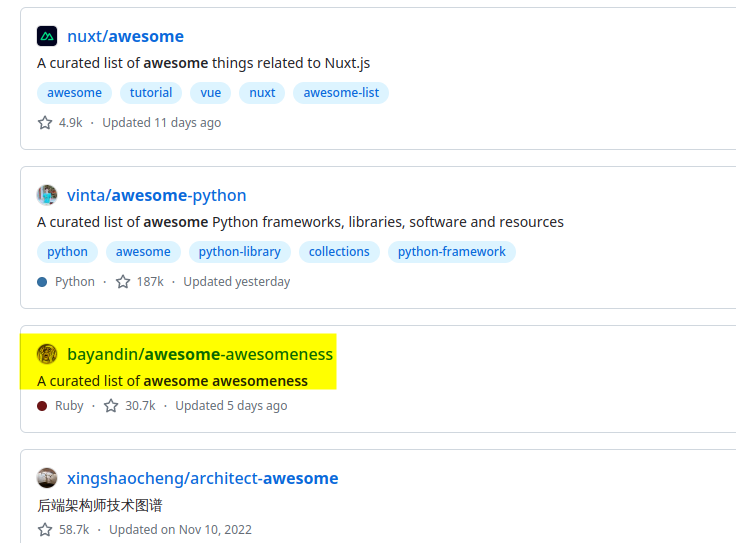

## 总结

<i>君子生非异也，善假于物也     --荀子</i>

---

### “That's Awesome”

&nbsp;&nbsp; &nbsp;github有一些库总是以“awesome”开头(立马想到了某自如)，而大多这些“awesome”多是站在巨人肩膀上进行总结的库，随便打开一个就是列了一大批方向和技术的“面向广度“的技能树，甚至其中一个库还是awesome in awesome：

&nbsp;&nbsp;&nbsp;&nbsp;但经过亲身经历，学东西在**深&精**而非**广&疏**，在一个领域上有更高的造诣后将所学进行泛化/举一反三效率更高，且已总结到学习的方法通常也会适用其他场景，即”归纳所知，演绎其他“。

&nbsp;&nbsp;&nbsp;&nbsp;另一方面，通常这些填鸭式方法可以变相走捷径，迅速了解某一领域的发展状况，这就让这些库在面试突击上大有用武之地，也是他们star特别多的原因之一。

&nbsp;&nbsp;&nbsp;&nbsp;但想学的深刻，要将information转换成knowdledge或wisdom就需要自身独立“痛苦”的思考得出**methodology**，而此非朝夕可至，需三省而日勉之。

&nbsp;&nbsp;&nbsp;&nbsp;bb了这么多，有些技巧还是可以省一些时间的：

&emsp;

### cheatSheet

&nbsp;&nbsp;&nbsp;&nbsp;说白了就是把一些自己会用到的又背不过的用到的时候又要找半天的命令总结下来，节省search过程的时间：

*[awesome-cheatseets](https://github.com/skywind3000/awesome-cheatsheets)*

&emsp;

### blog

&nbsp;&nbsp;&nbsp;&nbsp;由于网上的中文独立blog质量还不错，虽然有更新慢和难以找寻的问题，就诞生了一批awesome of blogs:

*[iOSBlogCN](https://github.com/tangqiaoboy/iOSBlogCN)*

*[awesome-blogCN-feeds](https://github.com/RSS-Renaissance/awesome-blogCN-feeds)*

&nbsp;&nbsp;&nbsp;&nbsp;（用newsblue/ioreader等工具来订阅RSS是近乎效率最高的阅读方式）

&emsp;

### blackMagic

1. webArchive + wget --mirror
2. 看源码 + 学思想
